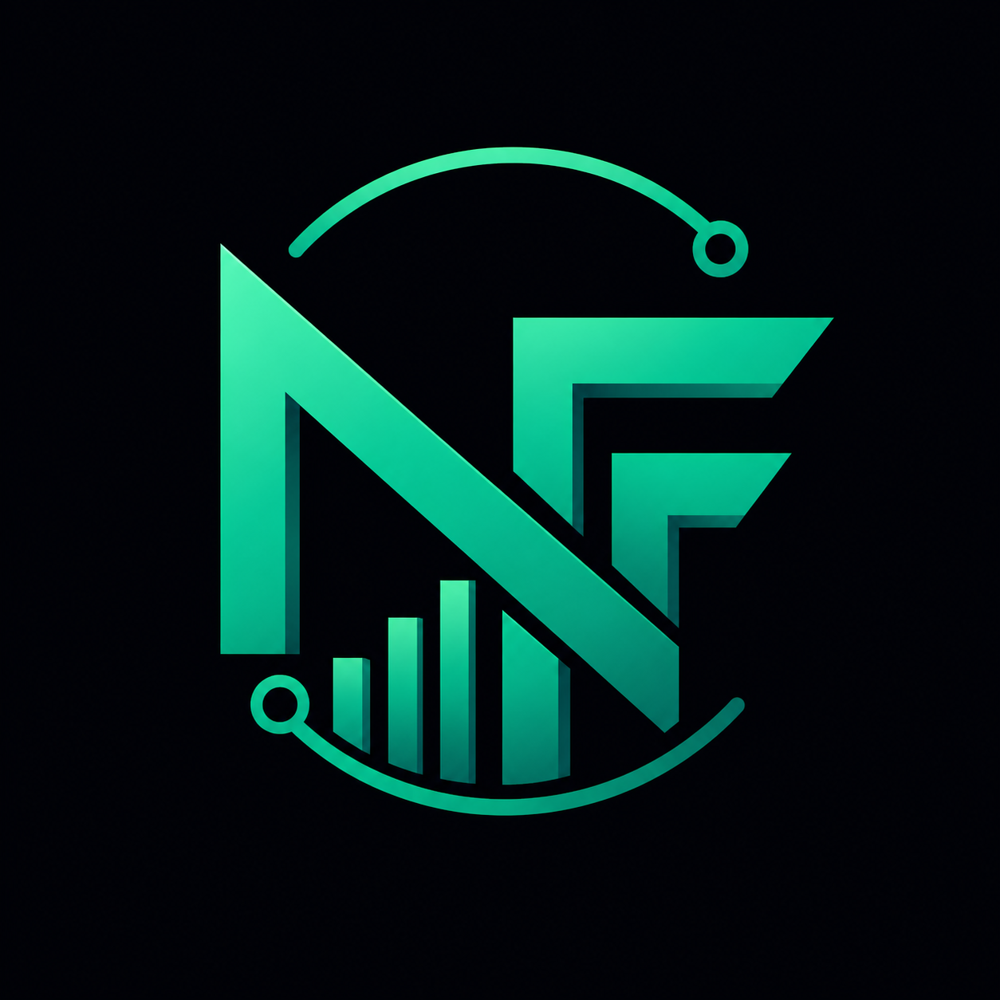
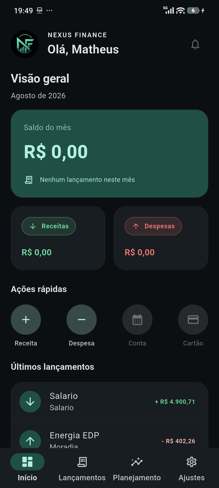
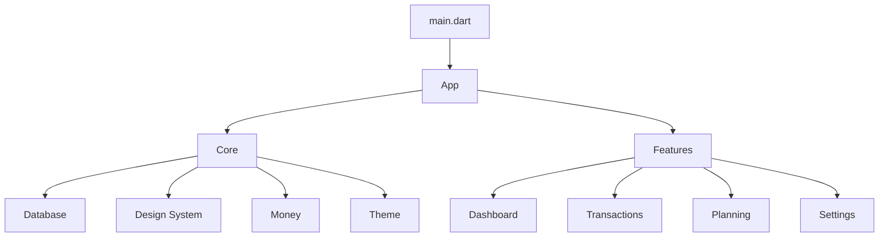

<div align="center">



# Nexus Finance

### Laboratório de desenvolvimento mobile • Finanças pessoais • Flutter/Dart


[](https://github.com/matheusamaro-dev/nexus-finance/actions/workflows/flutter-quality.yml)

**Aplicação de gestão financeira em evolução, utilizada como laboratório prático de arquitetura, persistência local, gerenciamento de estado e desenvolvimento de produto com Flutter.**

</div>

---

## 🎯 Propósito

O **Nexus Finance** é um projeto de estudo aplicado para desenvolver uma aplicação financeira organizada como produto de software, indo além do template inicial do Flutter.

O foco atual é consolidar fundamentos de:

- desenvolvimento mobile com Flutter e Dart;
- organização por funcionalidades;
- gerenciamento de estado com Riverpod;
- persistência local com Drift/SQLite;
- design system e temas;
- modelagem de domínio financeiro;
- testes, legibilidade e evolução incremental.

> **Status:** projeto ativo em desenvolvimento acadêmico e de portfólio. A arquitetura e as funcionalidades podem evoluir a cada iteração.

---

## 📱 Aplicativo

<div align="center">
  
</div>

O Dashboard reúne saldo mensal, receitas, despesas, ações rápidas e os lançamentos mais recentes em uma experiência mobile com tema escuro. A captura acima foi feita em um dispositivo Android físico durante a validação da identidade visual.

---

## 🧭 Direção do produto

A proposta é construir uma experiência simples para organização financeira pessoal, com módulos capazes de evoluir de forma independente.

A estrutura atual já separa o código em áreas de aplicação, núcleo compartilhado e funcionalidades.



---

## 🧩 Organização atual

### `lib/app`

Responsável pela composição principal da aplicação.

### `lib/core`

Componentes e serviços compartilhados:

- `database` — persistência e infraestrutura de dados;
- `design_system` — elementos visuais reutilizáveis;
- `money` — regras e utilitários relacionados a valores financeiros;
- `theme` — configuração visual e temas.

### `lib/features`

Estrutura orientada a funcionalidades:

- `dashboard`
- `transactions`
- `planning`
- `settings`

Essa organização facilita a evolução do projeto sem concentrar toda a lógica em uma única camada.

---

## 💻 Stack tecnológica

| Tecnologia | Papel no projeto |
|---|---|
| **Flutter** | framework de interface e aplicação mobile |
| **Dart** | linguagem principal |
| **Riverpod** | gerenciamento de estado e dependências |
| **Drift** | camada de persistência reativa |
| **SQLite** | armazenamento local |
| **path_provider** | acesso a diretórios da aplicação |
| **intl** | formatação e internacionalização |
| **uuid** | geração de identificadores |
| **flutter_lints** | padrões de qualidade estática |
| **build_runner** | geração de código durante o desenvolvimento |

---

## 🎨 Identidade visual

A marca do Nexus Finance combina o monograma `NF`, um gráfico crescente e uma linha de conexão. O símbolo representa organização financeira, evolução e tecnologia.

- **ícone do aplicativo:** símbolo `NF` sobre fundo escuro;
- **splash screen:** marca centralizada e integrada ao tema do app;
- **cor principal:** verde Nexus `#00BFA6`;
- **direção visual:** dark premium, limpa, tecnológica e legível;
- **guia de aplicação:** [`docs/brand-guide.md`](docs/brand-guide.md).

---

## 🏗️ Princípios de engenharia

O desenvolvimento segue uma linha incremental:

`Requisitos` → `Modelagem` → `Arquitetura` → `Implementação` → `Testes` → `Refatoração` → `Evolução`

Prioridades atuais:

- separação de responsabilidades;
- componentes reutilizáveis;
- persistência local previsível;
- código legível e testável;
- interface consistente;
- evolução por funcionalidades;
- documentação alinhada ao estado real do projeto.

---

## ▶️ Executando localmente

### Pré-requisitos

- Flutter configurado no ambiente
- SDK Dart compatível com o projeto
- dispositivo físico ou emulador Android configurado

### Instalação

```bash
git clone https://github.com/matheusamaro-dev/nexus-finance.git
cd nexus-finance
flutter pub get
```

Quando houver alterações em modelos que dependam de geração de código:

```bash
dart run build_runner build --delete-conflicting-outputs
```

Para executar:

```bash
flutter run
```

---

## ✅ Qualidade

Cada pull request para a `main` executa automaticamente formatação, análise estática e testes por meio do workflow **Flutter Quality**.

Antes de consolidar uma alteração:

```bash
flutter analyze
flutter test
```

Formatação:

```bash
dart format lib test
```

---

## 📁 Estrutura resumida

```text
nexus-finance/
├── .github/
│   └── workflows/
├── android/
├── assets/
│   └── branding/
├── docs/
│   └── screenshots/
├── lib/
│   ├── app/
│   ├── core/
│   │   ├── database/
│   │   ├── design_system/
│   │   ├── money/
│   │   └── theme/
│   ├── features/
│   │   ├── dashboard/
│   │   ├── planning/
│   │   ├── settings/
│   │   └── transactions/
│   └── main.dart
├── test/
├── analysis_options.yaml
├── pubspec.yaml
└── README.md
```

---

## 🛣️ Roadmap de evolução

### Fundação

- [x] estrutura inicial Flutter
- [x] organização em `app`, `core` e `features`
- [x] gerenciamento de estado com Riverpod
- [x] persistência local baseada em Drift/SQLite
- [x] base de design system e temas

### Identidade visual

- [x] símbolo oficial do Nexus Finance
- [x] ícone adaptativo do aplicativo Android
- [x] splash screen integrada ao tema escuro
- [x] aplicação da marca no Dashboard
- [x] guia de identidade e captura real do app

### Produto

- [ ] consolidar fluxo de transações
- [ ] evoluir dashboard financeiro
- [ ] ampliar planejamento e metas
- [ ] aprimorar preferências e configurações
- [ ] tratamento consistente de estados vazios e erros

### Qualidade

- [ ] ampliar cobertura de testes
- [x] automatizar formatação, análise estática e testes no CI
- [ ] documentar decisões arquiteturais importantes
- [x] adicionar screenshot e demonstração visual
- [ ] revisar acessibilidade e responsividade

### Próxima sequência

1. consolidar criação, edição e exclusão de transações;
2. ampliar os testes do domínio financeiro e dos fluxos principais;
3. evoluir planejamento, metas e acompanhamento mensal;
4. revisar acessibilidade e adaptação a diferentes tamanhos de tela;
5. preparar uma versão demonstrável para portfólio e distribuição interna.

---

## ⚠️ Escopo

O Nexus Finance é um **projeto educacional e de portfólio**. Não deve ser interpretado como sistema financeiro bancário, ferramenta de investimento ou solução destinada a armazenar dados sensíveis de produção sem uma revisão específica de segurança.

---

## 👨‍💻 Autor

**Matheus Amaro**  
Técnico de Manutenção • Estudante de Análise e Desenvolvimento de Sistemas • Linux • Automação • Desenvolvimento de Software

[](https://www.linkedin.com/in/matheus-amaro-costa)
[](https://github.com/matheusamaro-dev)

---

<div align="center">
<sub>Projeto em evolução contínua para transformar estudo em experiência prática de engenharia de software.</sub>
</div>
